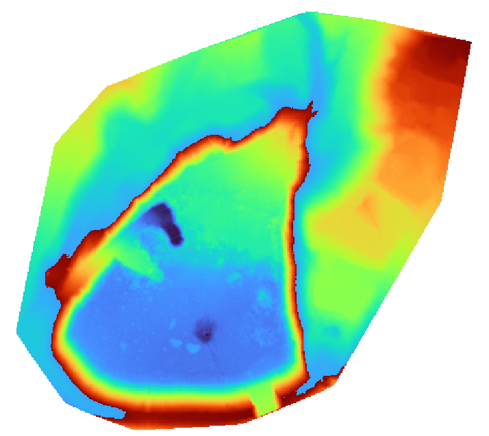
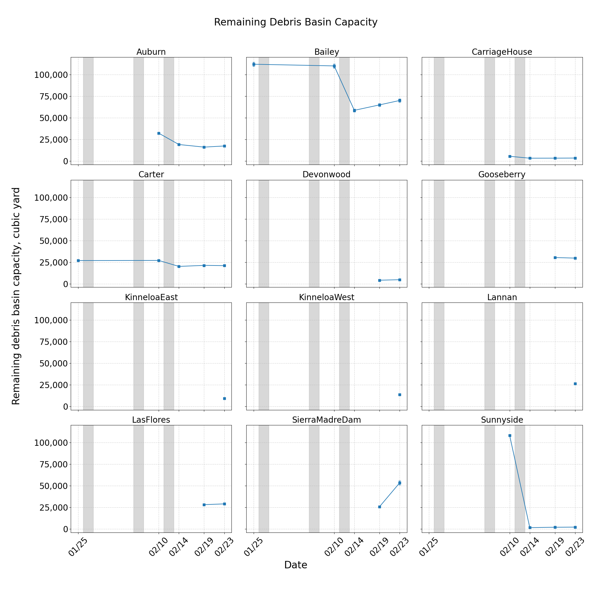

# UAV Lidar-Based Debris Basin Capacity Assessment Following the 2025 LA Wildfire

Zhiang Chen*, Emily Geyman, Michael Lamb

\*zhiang.chen@caltech.edu

Feb 27, 2025

## Introduction
In the aftermath of the January 2025 Eaton and Palisades wildfires in Los Angeles County, assessing the remaining capacities of debris basins is critical for forecasting potential hazards associated with upcoming rain events. This report provides a low-cost, effecient assessment of debris basin capacities using UAV-based lidar surveys conducted before and after rainfall events. By leveraging high-resolution topographic data, we quantify sediment accumulation and estimate the remaining capacity of debris basins in the wildfire-affected regions. The results from this study are intended to support emergency management agencies in prioritizing debris basin cleanouts and forecasting potential debris flow risks for upcoming storm events.

## Methodology

### Data Collection
To conduct high-resolution surveys of debris basins, we utilized the following equipment:

- **Unpiloted Aerial Vehicle (UAV):** DJI Matrice 350 RTK, a high-precision drone with real-time kinematic (RTK) capabilities for accurate georeferencing.
- **Lidar Sensor:**  DJI Zenmuse L2, a high-resolution lidar system optimized for topographic mapping and terrain modeling. With its five-return capability, this lidar sensor enables effective vegetation filtering. 
- **RTK GPS Base:** Emlid Reach RS3, a multi-band GNSS receiver used for precise ground control point measurements.
Power System: DJI BS65 Intelligent Battery Station with five pairs of DJI TB65 batteries, ensuring extended flight operations. A portable power generator is also used to recharge batteries in the field, allowing for continuous operation by alternating battery usage efficiently.
- **Software:** DJI Terra, used for lidar data processing, point cloud generation, and bare ground classification.

We conducted UAV surveys at an altitude of 100–120 meters above ground level, utilizing the terrain-following feature to maintain a consistent ground sampling resolution. This approach resulted in a 3.5 cm / pixel resolution and a point density of 500-700 points / $m^2$. We set an 80% front overlap and a 20% lateral overlap between data frames. Additionally, RGB image collection during surveys was enabled to colorize the point clouds. The UAV operated at a maximum speed of 15 m/s, with an average flight speed of 6 m/s.

We collected UAV LiDAR data from debris basins affected by the Eaton wildfire to assess post-fire sediment accumulation and remaining basin capacity. Table 1 provides an overview of the surveys conducted, including flight dates and locations. Figure 1 illustrate points clouds from the UAV lidar surveys and data processing. 

#### Table 1: Debris Basin Flight Dates

| Debris Basin    | Flight Dates                                      |
|----------------|--------------------------------------------------|
| Auburn        | 20250125, 20250210, 20250214, 20250219, 20250223  |
| Bailey        | 20250125, 20250210, 20250214, 20250219, 20250223  |
| CarriageHouse | 20250210, 20250214, 20250219, 20250223            |
| Carter        | 20250125, 20250210, 20250214, 20250219, 20250223  |
| Eaton         | 20250219, 20250223                                |
| Devonwood     | 20250219, 20250223                                |
| Gooseberry    | 20250219, 20250223                                |
| KinneloaEast  | 20250223                                         |
| KinneloaWest  | 20250223                                         |
| Lannan        | 20250223                                         |
| LasFlores     | 20250219, 20250223                                |
| SierraMadreDam| 20250219, 20250223                                |
| Sunnyside     | 20250210, 20250214, 20250219, 20250223            |

#### Figure 1: Point clouds from UAV lidar surveys: Auburn, Bailey, Sierra Mandre Dam, and Sunnyside

    
    

    
    

### Capacity Estimation
We estimated debris basin capacity using reconstructed point clouds. From these point clouds, bare ground points were classified, allowing us to generate both Digital Elevation Models (DEM) and Digital Surface Models (DSM). The DEM represents the terrain without vegetation or structures, providing an upper-bound capacity estimation, while the DSM includes surface features such as trees and debris, yielding a lower-bound capacity estimation. This distinction is crucial, as removing trees and obstructions increases the available capacity for debris storage.

For our analysis, we used two reference elevations: the spillway elevation and the crest elevation of each debris basin in the point cloud. The spillway elevation represents the minimum elevation at which overflow occurs, while the crest elevation defines the maximum designed storage capacity before overtopping. By comparing these reference elevations with the DEM and DSM, we estimated a range of possible remaining capacities for each basin. 

Figure 2 presents the bare ground classification derived from multi-return lidar data, highlighting how vegetation and other obstructions were filtered out. Figure 3 illustrates the DEM and DSM along with their corresponding spillway and crest elevations, providing a visual representation of the estimated capacity ranges.

#### Figure 2: Point cloud ground classification

    

#### Figure 3: Digital Elevation Models (DEM) and Digital Surface Models (DSM) with Spillway and Crest Elevation

    
    

## Results

Figure 4 presents the estimated debris basin capacity, highlighting variations across different dates. Figure 5 depicts the estimated debris basin capacity as a percentage of the designed capacity, providing insight into the extent to which each basin retains its intended storage volume. Table 2 provides a detailed breakdown of the capacity estimates.

#### Figure 4: Estimated Debris Basin Capacity

    

#### Figure 5: Estimated Debris Basin Capacity as a Percentage of Designed Capacity

    

### Table 2: Estimated Debris Basin Capacity

| Name           | Date      | Spillway Capacity | Crest Capacity | Spillway Capacity Ratio | Crest Capacity Ratio | Max Design Capacity |
|--------------|----------|------------------|---------------|----------------------|------------------|-------------------|
| Auburn       | 20250125 | 18030            | 32792         | 46.23%               | 84.08%           | 39000             |
| Auburn       | 20250210 | 13742            | 32322         | 35.24%               | 82.88%           | 39000             |
| Auburn       | 20250214 | 1878             | 19227         | 4.82%                | 49.30%           | 39000             |
| Auburn       | 20250219 | 3237             | 16224         | 8.30%                | 41.60%           | 39000             |
| Auburn       | 20250223 | 3475             | 17537         | 8.91%                | 44.97%           | 39000             |
| Bailey       | 20250125 | 63023            | 112078        | 48.86%               | 86.88%           | 129000            |
| Bailey       | 20250210 | 61193            | 110139        | 47.44%               | 85.38%           | 129000            |
| Bailey       | 20250214 | 7002             | 58749         | 5.43%                | 45.54%           | 129000            |
| Bailey       | 20250219 | 15932            | 65056         | 12.35%               | 50.43%           | 129000            |
| Bailey       | 20250223 | 16742            | 70150         | 12.98%               | 54.38%           | 129000            |
| CarriageHouse | 20250210 | 3205             | 5609          | 52.54%               | 91.95%           | 6100              |
| CarriageHouse | 20250214 | 998              | 3407          | 16.36%               | 55.85%           | 6100              |
| CarriageHouse | 20250219 | 1256             | 3455          | 20.59%               | 56.64%           | 6100              |
| CarriageHouse | 20250223 | 1356             | 3577          | 22.23%               | 58.64%           | 6100              |
| Carter       | 20250125 | 17732            | 26870         | 63.33%               | 95.96%           | 28000             |
| Carter       | 20250210 | 17478            | 26994         | 62.42%               | 96.41%           | 28000             |
| Carter       | 20250214 | 11134            | 20079         | 39.76%               | 71.71%           | 28000             |
| Carter       | 20250219 | 11850            | 21270         | 42.32%               | 75.96%           | 28000             |
| Carter       | 20250223 | 12057            | 20991         | 43.06%               | 74.97%           | 28000             |
| Devonwood    | 20250219 | 1879             | 4128          | 17.08%               | 37.53%           | 11000             |
| Devonwood    | 20250223 | 2332             | 4697          | 21.20%               | 42.70%           | 11000             |
| Gooseberry   | 20250219 | 8907             | 30336         | 25.45%               | 86.67%           | 35000             |
| Gooseberry   | 20250223 | 8606             | 29685         | 24.59%               | 84.81%           | 35000             |
| KinneloaEast | 20250223 | 3026             | 9377          | 8.41%                | 26.05%           | 36000             |
| KinneloaWest | 20250223 | 1691             | 13739         | 4.83%                | 39.25%           | 35000             |
| Lannan       | 20250223 | 4200             | 26258         | 10.24%               | 64.04%           | 41000             |
| LasFlores    | 20250219 | 3104             | 28208         | 5.54%                | 50.37%           | 56000             |
| LasFlores    | 20250223 | 4139             | 29076         | 7.39%                | 51.92%           | 56000             |
| SierraMadreDam | 20250219 | 19843           | 25825         | 14.59%               | 18.99%           | 136000            |
| SierraMadreDam | 20250223 | 45665           | 53415         | 33.58%               | 39.28%           | 136000            |
| Sunnyside    | 20250210 | 1802             | 4012          | 53.00%               | 118.00%          | 3400              |
| Sunnyside    | 20250214 | 0                | 1648          | 0.00%                | 48.47%           | 3400              |
| Sunnyside    | 20250219 | 150              | 2074          | 4.41%                | 61.00%           | 3400              |
| Sunnyside    | 20250223 | 254              | 2228          | 7.47%                | 65.53%           | 3400              |

## Conclusion
This study demonstrates the effectiveness of UAV-based lidar surveys in rapidly assessing debris basin capacities following the 2025 LA Wildfire. By leveraging high-resolution point clouds, we classified bare ground surfaces and generated DEMs and DSMs to estimate sediment accumulation and remaining storage capacity. Our results highlight significant variability in sediment deposition across different debris basins, with some retaining substantial capacity while others have been heavily impacted by post-fire debris flows. By comparing spillway and crest elevations with DEM and DSM models, we provided a range of capacity estimates that can be used to prioritize debris basin cleanouts. These findings are particularly valuable for emergency management agencies to inform hazard forecasting and debris flow mitigation strategies before the next storm event.

